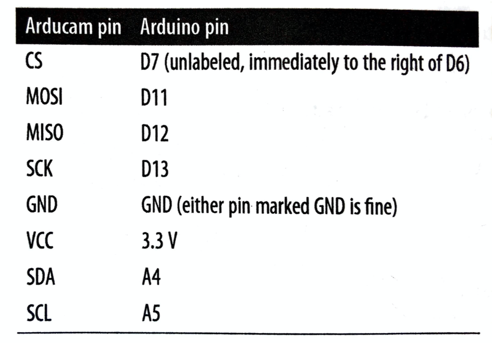
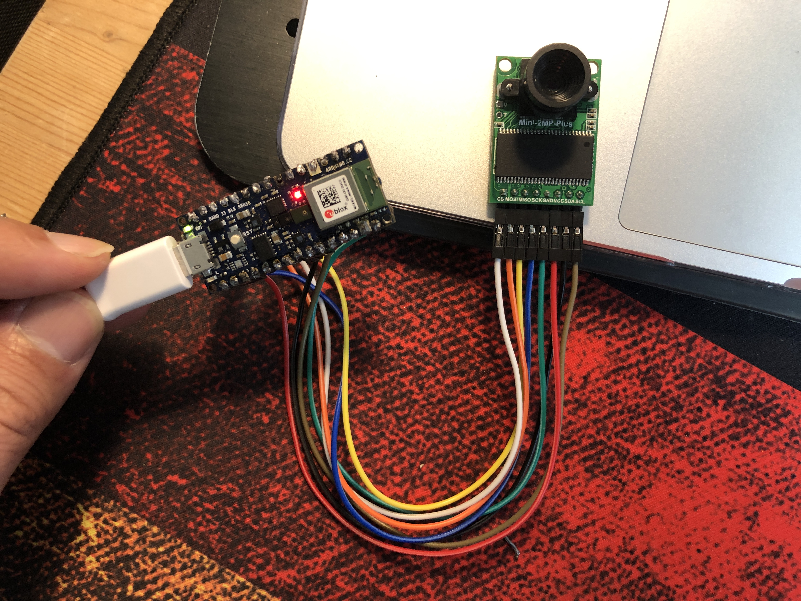
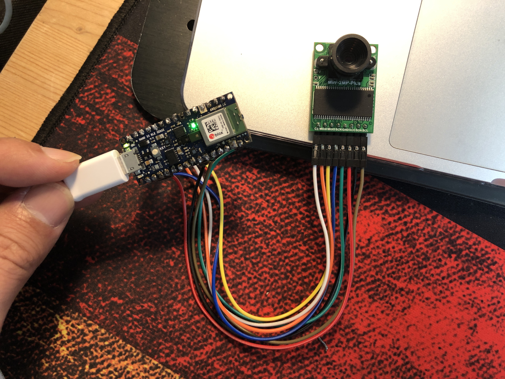

## Ch.9. Person Detection :running:


### :herb: Environment

* [Arduino Nano 33 BLE](https://store.arduino.cc/usa/nano-33-ble-sense)
* [Arducam Mini-2MP-Plus](https://www.amazon.com/Arducam-Module-Megapixels-Arduino-Mega2560/dp/B012UXNDOY)


### :zap: Prerequisites

1. Install 'JPEGDecoder' library via Arduino IDE library manager.
2. Download the [Arducam library](https://github.com/ArduCAM/Arduino) and copy the ArduCAM subdirectories into *Arduino/libraries*. (To find the libraries directory on your machine, check the Sketchbook location in the Arduino IDE's Preferences window.)
3. Edit *Arduino/libraries/ArduCAM/memorysaver.h* like following.
	Comment all other lines except here.

	```c
    ...
    //Step 1: select the hardware platform, only one at a time
    //#define OV2640_MINI_2MP
    //#define OV3640_MINI_3MP
    //#define OV5642_MINI_5MP
    //#define OV5642_MINI_5MP_BIT_ROTATION_FIXED
    #define OV2640_MINI_2MP_PLUS
    //#define OV5642_MINI_5MP_PLUS
    //#define OV5640_MINI_5MP_PLUS
    ...
    
    ```
4. Edit *Arduino/libraries/JPEGDecoder/src/User_Config.h* like following.
	Comment `#define LOAD_SD_LIBRARY` and `#define LOAd_SDFAT_LIBRARY`

	```c
    // Comment out the next #defines if you are not using an SD Card to store the JPEGs
    // Commenting out the line is NOT essential but will save some FLASH space if
    // SD Card access is not needed. Note: use of SdFat is currently untested!

    //#define LOAD_SD_LIBRARY // Default SD Card library
    //#define LOAD_SDFAT_LIBRARY // Use SdFat library instead, so SD Card SPI can be bit bashed
    ...
    ```


### :camera: Connect the camera with Arduino 


<center>

</center>

* After connecting, run the `person_detection` Arduino_TensorFlowLite example at Arduino IDE!

### :sparkles: Results 

* #### No person is detected :point_right: Red Light
<center>

</center>

* #### A person is detected :point_right: Green Light
<center>

</center>


###   The Basic Flow :surfer:

<center>

</center>


#### Sequences
1. **`Image Provider`**'s **GetImage()** takes a picture from the camera. &rightarrow;
2.  **`tflite::MicroInterpreter`**' classifies the input and returns **output**. &rightarrow; 	
3. **`Detection Responder`** runs **RespondToDetection()** to order the response.


	  