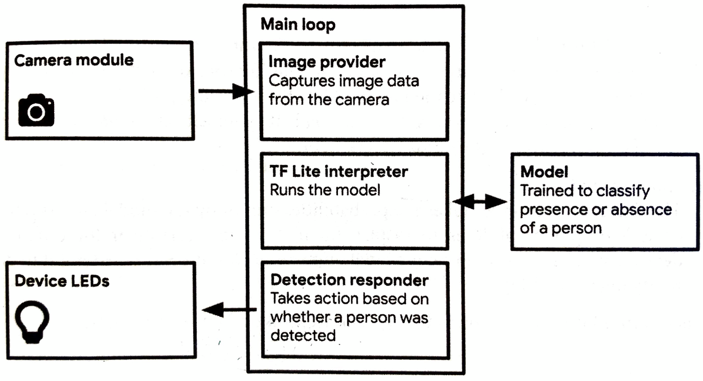
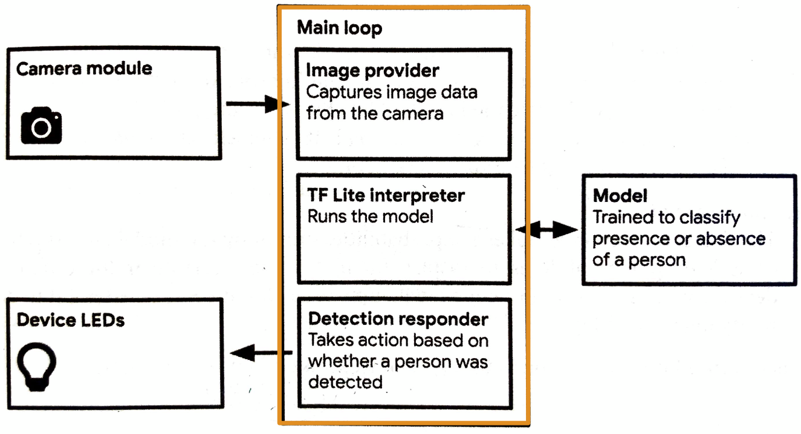

<!--page_number:true -->
<!-- $width:1300 -->
<!-- $height:900 -->


# TinyML 
## Ch.9, 10. Person Detection :running:
#### 2020.09.17
#### Peter Cha 

---
##   The Basic Flow :surfer:





---

##   The Basic Flow :surfer:



---

##   The Basic Flow :surfer:

### Sequences:
1. **`Image Provider`**'s **GetImage()** 
takes a picture from the camera. &rightarrow;

2.  **`tflite::MicroInterpreter`**' classifies the input
 and returns **output**. &rightarrow; 	

3. **`Detection Responder`** runs **RespondToDetection()**


---
## Arduino Algorithm
### `main.cc`

```c++
#include int main(int argc, char* argv[]) {

  setup();
  
  while (true) {
    loop();
  }
}
```


---
### `main_functions.cc`

1. Global variables

```c++
namespace {

  tflite::ErrorReporter* error_reporter = nullptr;
  const tflite::Model* model = nullptr;
  
  tflite::MicroInterpreter* interpreter = nullptr;
  TfLiteTensor* input = nullptr;

  constexpr int kTensorArenaSize = 136 * 1024;
  static uint8_t tensor_arena[kTensorArenaSize];

}  // namespace

```

---
### `main_functions.cc`

2. void setup()

```c++
void setup() {

    model = tflite::GetModel(g_person_detect_model_data)
  
    static tflite::MicroMutableOpResolver<3> micro_op_resolver;
    micro_op_resolver.AddAveragePool2D();
    micro_op_resolver.AddConv2D();
    micro_op_resolver.AddDepthwiseConv2D();

    static tflite::MicroInterpreter static_interpreter(
        model, micro_op_resolver, tensor_arena,
        kTensorArenaSize, error_reporter);

    interpreter = &static_interpreter;

    input = interpreter->input(0);
}
```

---

### `main_functions.cc`

3. void loop()

```c++
void loop() {
  // Get image from provider.
  if (kTfLiteOk != GetImage(error_reporter, 
  			    kNumCols, 
			    kNumRows, 
			    kNumChannels,
                            input->data.uint8)) {
    TF_LITE_REPORT_ERROR(error_reporter, "failed.");
  }
  
  // Interpreter do the job
  TfLiteTensor* output = interpreter->output(0);
  
  // return the result
  uint8_t person_score = output->data.uint8[kPersonIndex];
  uint8_t no_person_score = output->data.uint8[kNotAPersonIndex];
  RespondToDetection(error_reporter, 
  		     person_score, 
                     no_person_score);
}
```

---

## [MobileNet](https://www.stand-firm-peter.me/2019/08/11/mobilenet/)? :no_mouth:

<center></center>


