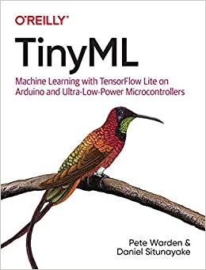

# TinyML-Code-Practice-Peter

* Code Practice logs of [TinyML](https://www.oreilly.com/library/view/tinyml/9781492052036/). 

  

#### :herb: Environment  
* macOS Catalina 
* Make, version 4.3
* Arduino NANO 33 Sense Board BLE

#### :clipboard: Contents
* Ch5, 6. **[Hello World]()**

* Ch7, 8. **[Wake-Word Detection]()**

* Ch9, 10. **[Person Detection](https://github.com/PeterCha90/TinyML-Code-Practice-Peter/tree/master/Person_Detection)**
